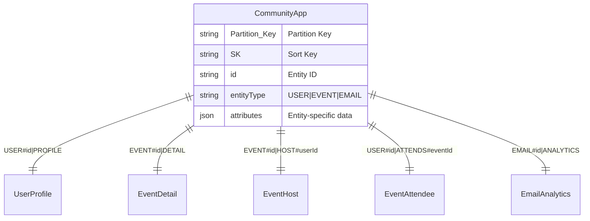

# CRM Event Analytics System

A comprehensive Customer Relationship Management (CRM) system with event analytics, built using FastAPI and DynamoDB. The system tracks users, events, and email campaigns with advanced filtering capabilities and real-time analytics.

## 🏗️ Database Design

### Single Table Design

The system uses a **DynamoDB single-table design** for optimal performance and cost efficiency. All data is stored in a single table (`CommunityApp`) with different entity types distinguished by their partition and sort keys.



### Access Patterns

| Pattern | GSI | Example Query |
|---------|-----|---------------|
| Users by Company | `GSI_ByCompany` | Find all users at "Tech Corp" |
| Users by Job Title | `GSI_ByJobTitle` | Find all "Developers" |
| Users by Location | `GSI_ByLocation` | Find users in "SF, CA" |
| Users by Activity | `GSI_UsersByActivity` | Most active event attendees |
| Event Attendees | `GSI_EventAttendees` | Who attended event X? |
| Events by Date | `GSI_EventsByDate` | Events in date range |

### Key Design Decisions

1. **Single Table Design**: Reduces costs and latency by eliminating joins
2. **Composite Sort Keys**: Enable sorting within filtered results (e.g., `LASTNAME#Smith#USER#123`)
3. **Denormalized Counters**: Store `hostedEventCount` and `attendedEventCount` for fast queries
4. **Strategic GSIs**: 8 GSIs support all major access patterns efficiently
5. **Intelligent Index Selection**: Service automatically chooses the most selective index

## 🚀 API Reference

### User Management

#### Create User
```http
POST /users
Content-Type: application/json

{
  "firstName": "John",
  "lastName": "Doe",
  "email": "john@example.com",
  "phoneNumber": "+1234567890",
  "company": "Tech Corp",
  "jobTitle": "Developer",
  "city": "San Francisco",
  "state": "CA"
}
```

#### Filter Users
```http
GET /users?company=Tech%20Corp&jobTitle=Developer&limit=50

# Advanced filtering
GET /users?hostedEventCountMin=5&attendedEventCountMax=10
GET /users?city=San%20Francisco&state=CA
```

### Event Management

#### Create Event
```http
POST /events
Content-Type: application/json

{
  "slug": "tech-meetup-2024",
  "title": "Tech Meetup 2024",
  "description": "Annual technology meetup",
  "startAt": "2024-06-15T18:00:00Z",
  "endAt": "2024-06-15T21:00:00Z",
  "venue": "Tech Hub",
  "maxCapacity": 100,
  "owner": "user-123",
  "hostIds": ["user-123", "user-456"],
  "attendeeIds": ["user-789", "user-101"]
}
```

### Email Campaigns

#### Send Bulk Email
```http
POST /emails/send
Content-Type: application/json

{
  "subject": "Tech Meetup Invitation",
  "body": "Join us for our annual tech meetup!",
  "utmCampaign": "meetup-2024",
  "utmSource": "crm",
  "utmMedium": "email",
  "company": "Tech Corp"
}
```

#### Email Analytics
```http
GET /emails/analytics?status=sent&utm_campaign=meetup-2024

# Date filtering
GET /emails/analytics?start_date=2024-01-01T00:00:00Z&end_date=2024-12-31T23:59:59Z

# Pagination
GET /emails/analytics?limit=25&nextToken=eyJQSyI6...
```

## 🛠️ Development Setup

### Prerequisites

- Docker and Docker Compose
- Python 3.11+ (for local development)
- Git

### Quick Start

1. **Set up environment**
   ```bash
   cp .env.example .env
   # Edit .env with your configuration
   ```

2. **Start the development environment**
   ```bash
   docker compose up -d
   ```

3. **Initialize the database**
   ```bash
   docker compose exec app python scripts/init_dynamodb.py
   ```

4. **Access the application**
   - API: http://localhost:8000
   - API Documentation: http://localhost:8000/docs

## 🧪 Testing

### Running Tests

The project includes a comprehensive test suite with 55+ tests covering all functionality.

```bash
# Run all tests
docker compose run --rm test

# Run specific test file
docker compose run --rm test pytest tests/test_user.py -v

# Run with coverage
docker compose run --rm test pytest --cov=app --cov-report=html

# Run specific test pattern
docker compose run --rm test pytest -k "user" -v
```

### Test Categories

1. **Unit Tests**: Test individual service methods
   - `test_user.py` - User creation and filtering
   - `test_event.py` - Event creation and transactions
   - `test_email.py` - Email sending and background tasks
   - `test_email_analytics.py` - Email analytics and filtering

2. **API Tests**: Test REST endpoints
   - `test_user_api.py` - User API endpoints
   - `test_event_api.py` - Event API endpoints
   - `test_email_api.py` - Email API endpoints

3. **Integration Tests**: Test complex workflows
   - `test_flexible_filtering.py` - Advanced user filtering

### Code Quality

```bash
# Format code
docker compose run --rm app black .

# Lint code
docker compose run --rm app flake8 --max-line-length=120 app tests


### Performance Considerations

#### Intelligent User Filtering (`filter_users`)

The user filtering system implements intelligent index selection to optimize query performance:

**1. Index Selectivity Analysis**
```python
# System automatically chooses the most selective filter
selectivity_scores = {
    "location": 0.05,     # 5% of users per city/state (most selective)
    "company": 0.1,       # 10% of users per company
    "jobTitle": 0.2,      # 20% of users per job title
    "eventCounts": 0.8    # 80% of users in typical ranges (least selective)
}
```

**2. Query Strategy Selection**
- **GSI Query**: Used when selective filters are available (company, jobTitle, location)
- **Table Scan**: Fallback when only non-selective filters are present
- **Hybrid Approach**: GSI query + memory filtering for complex combinations

**3. Performance Flow**
```
Request: ?company=TechCorp&jobTitle=Developer&hostedEventCountMin=5

1. Analyze filters → company (0.1) vs jobTitle (0.2)
2. Choose company GSI (most selective)
3. Query GSI_ByCompany with PK="COMPANY#TechCorp"
4. Filter results in memory for jobTitle + eventCount
5. Return paginated results with nextToken
```

**4. Pagination Optimization**
- Uses DynamoDB's native pagination with `LastEvaluatedKey`
- Stateless pagination tokens (base64-encoded)
- Adaptive batching: fetches 3x-5x requested limit to account for filtering

#### Email Analytics Filtering (`get_analytics`)

The email analytics system handles high-volume email tracking with efficient filtering:

**1. Scan-Based Architecture**
```python
# Optimized for email analytics access patterns
FilterExpression: SK = "ANALYTICS"  # Isolate email records
ScanLimit: adaptive (50-100 items per batch)
MemoryFiltering: complex UTM + date filters
```

**2. Multi-Layer Filtering Strategy**
```
Request: ?status=sent&utm_campaign=holiday-2024&start_date=2024-12-01

1. DynamoDB Scan: Filter by SK="ANALYTICS" (basic filter)
2. Memory Filter: Apply status, UTM, and date filters
3. Sort: By createdAt descending (newest first)
4. Paginate: Return requested limit + nextToken
```

**4. UTM Parameter Indexing**
```python
# Email analytics items structure
{
    "PK": "EMAIL#uuid",
    "SK": "ANALYTICS",
    "status": "sent|failed|queued",
    "utmCampaign": "holiday-2024",
    "utmSource": "newsletter",
    "utmMedium": "email",
    "createdAt": "2024-12-01T10:00:00Z"
}
```
